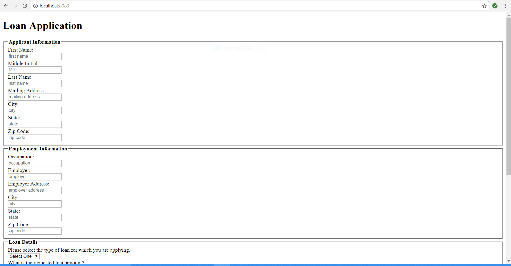
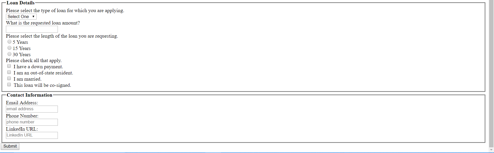

# Banking Form

### Project Summary
This is the first project I completed during my education at Nashville Software School. This project was assigned to us as beginning HTML practice.  There is no CSS included in this project, as we had not learned it at the time this project was completed.

### Task
Build a form that accepts a loan application. It must include the requirements listed below.

### Requirements
1. Applicant first name
1. Applicant middle initial
1. Applicant last name
1. Applicant address
1. Applicant occupation
1. Applicant employer
1. Employer address
1. Type of loan select element with these options:
	1. Commercial
	1. Real estate
	1. Personal
	1. Mortgage
1. Requested amount of loan
1. Radio button elements for loan length
	1. 5 years
	1. 15 years
	1. 30 years
1. Checkbox group for special conditions
	1.	I have a down payment
	1. Out-of-state resident
	1.	Married
	1.	Loan will be co-signed
1. A text area to allow for additional comments
1. Applicant email address
1. Applicant telephone number
1. Applicant LinkedIn URL

### Screen shot of form

### How do I run this project locally?
